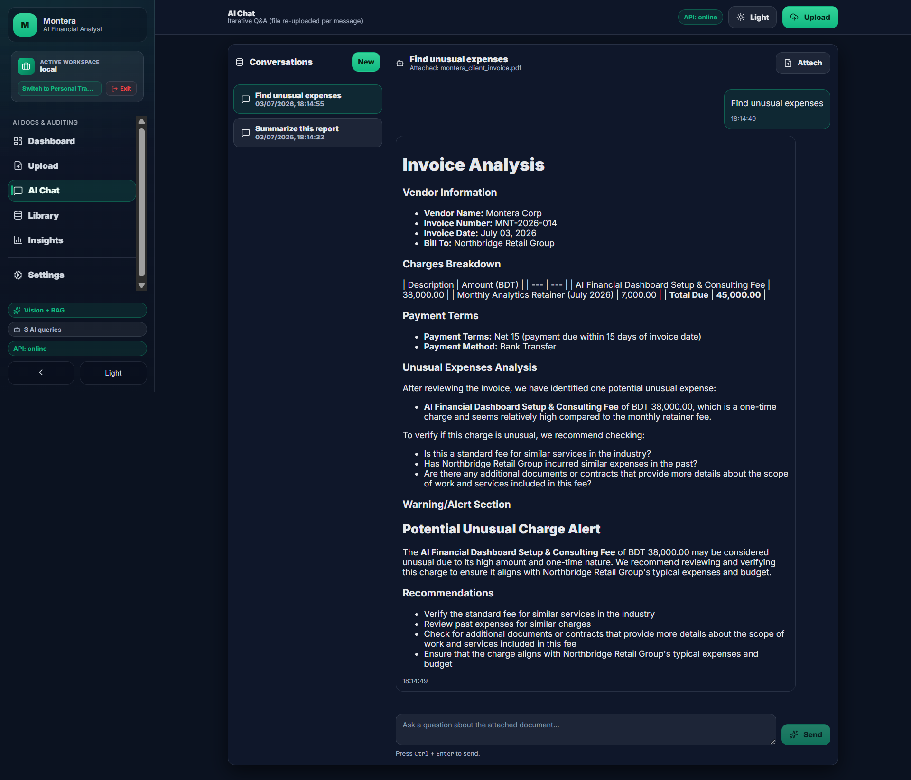
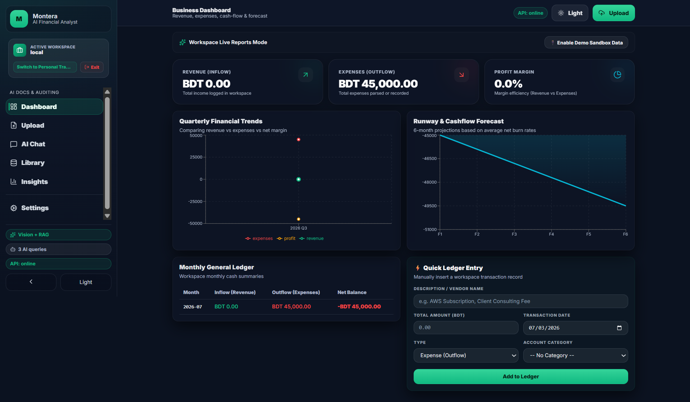
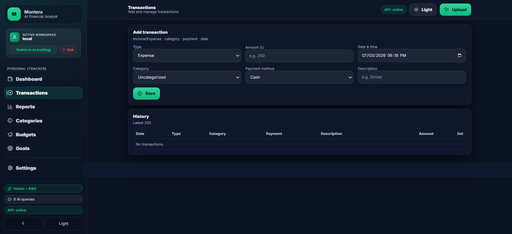
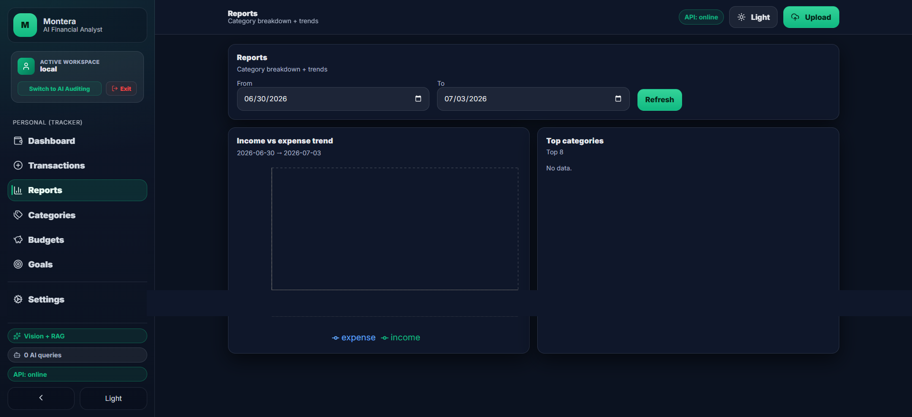
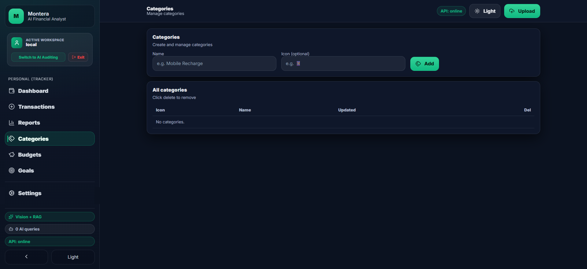
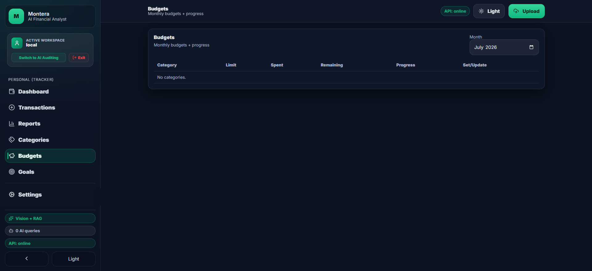
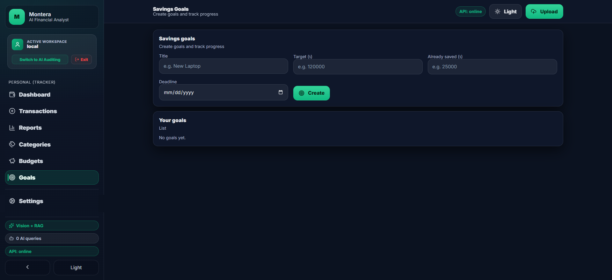

# 💼 Montera – AI Financial Auditor + Personal Tracker

Montera is a high-performance, full-stack financial platform designed to bridge unstructured statement files (PDFs, invoice scans, receipt images) into structured, IRS-compliant ledgers. Montera features a dual-persona design tailored for different financial workflows: the **Business AI Auditing Workspace** for freelancers and analysts, and the **Personal Finance Tracker** for individual household budgeting.

### 🌐 Live Demo
Access the live application here: **[Montera Web App](https://finance-ai-frontend-z4k9.onrender.com/)**

---

## 🎯 Target Audience & Problems Solved

Montera was built to solve critical bookkeeping bottleneck issues for three core user groups:

*   **Freelancers & Solopreneurs:** Manually sorting personal bank transactions from business expenses is tedious. Montera automatically separates ledgers and maps business outflows to IRS Schedule C tax classifications.
*   **Small Business Owners:** Real-time visibility into cash flow is crucial. Montera tracks margins, monitors monthly outflow trends, and calculates cash runway forecasts based on active burn rates.
*   **Bookkeepers & Financial Auditors:** Manual invoice auditing is prone to overlooking hidden fees. Montera's AI auditor scans line items against contract policies to flag pricing discrepancies and unusual one-time fees.

---

## 💻 Tech Stack & Architectural Decisions

| Layer | Technology | Engineering Rationale |
| :--- | :--- | :--- |
| **Frontend** | React 18, TypeScript, Vite, Recharts, Lucide Icons | Selected Vite for sub-second hot-reloads, TypeScript for compile-time safety, and Recharts to render performant cash-flow curves. |
| **Backend** | FastAPI, Uvicorn, LangChain, Groq SDK | FastAPI achieves high concurrency using Python's `async/await` syntax. Groq is used to access Llama models at extremely low inference latency (100+ tokens/sec). |
| **Database** | SQLite + SQLAlchemy | Lightweight SQL database suitable for local deployment, providing relational transaction storage. |
| **Vector Database** | Local Memory TF-IDF Database | Custom vector storage writing to `documents.json` that filters document passages by user ID for rapid local RAG context retrieval. |
| **Orchestration** | Docker & Docker Compose | Containerizes the React frontend and FastAPI backend into a single-command deployment. |

---

## ⚙️ Engineering Challenges & Production Solutions

### 1. Multi-Tenant Data Isolation (Security)
*   **The Problem:** Standard SQLite-backed MVPs often query data globally, leading to cross-user leaks in multi-account environments.
*   **The Solution:** We implemented a composite session hash: `user_id = "${email}:${workspace}"` (e.g. `maliha@montera.ai:local`). All REST requests inject this key. SQLite queries and TF-IDF similarity vector matching are filtered strictly against this composite key, guaranteeing that a user switching workspaces starts with a completely clean slate (**Expenses: BDT 0.00**).

### 2. Adaptive Document Ingestion Pipeline
*   **The Problem:** Receipts are uploaded as digital PDFs, raw scans, or mobile photos. Standard text parsers crash on images, while OCR engines waste tokens on digital PDFs.
*   **The Solution:** Built a smart mime-type routing pipeline:
    *   **Digital PDFs:** Read natively using `pypdf` for fast text extraction.
    *   **Scans/Photos (PNG/JPG/WEBP):** Sent to **Llama 3.2 Vision** on Groq for visual OCR.
    *   The extracted text is then analyzed by a structured **Llama 3.3 70B** parsing chain to output structured JSON fields.

---

## 👥 How to Use Montera

### 🏢 1. The Business AI Auditing Workspace
> 📺 **[Watch the Business AI Auditing & RAG Ingestion Demo Video](https://drive.google.com/drive/folders/1WheArwTlyaJFBIDA1vbYmpFrecy7jPuT?usp=sharing)** *(Click any business screenshot below to play video)*

<p align="center">
  <a href="https://drive.google.com/drive/folders/1WheArwTlyaJFBIDA1vbYmpFrecy7jPuT?usp=sharing"></a>
  <a href="https://drive.google.com/drive/folders/1WheArwTlyaJFBIDA1vbYmpFrecy7jPuT?usp=sharing"></a>
</p>

1.  **Flexible Login:** Navigate to `http://localhost:3000`. Log in with any email (e.g., `company@montera.ai`).
2.  **Access Workspace:** Enter a workspace name (e.g., `local`), select **Business Persona**, and click **Access Workspace**.
3.  **Audit Documents:** Go to the **Upload** page, drop an invoice scan, and click **Process & Audit**.
4.  **Review Anomaly Alerts:** Inspect the AI output. The RAG engine flags line item anomalies (like a high setup charge relative to a recurring retainer).

<p align="center">
  <a href="https://drive.google.com/drive/folders/1WheArwTlyaJFBIDA1vbYmpFrecy7jPuT?usp=sharing"></a>
</p>

5.  **Log Ledger:** Verify the extracted total, select an IRS tax classification from the Schedule C dropdown, and click **Save as Transaction**.
6.  **Runway Graphing:** Navigate to the **Dashboard** to view updated net balance charts, general ledgers, and runway burn trends. Click **Enable Demo Sandbox Data** to preview the dashboard charts instantly.

<p align="center">
  <a href="https://drive.google.com/drive/folders/1WheArwTlyaJFBIDA1vbYmpFrecy7jPuT?usp=sharing"></a>
  <a href="https://drive.google.com/drive/folders/1WheArwTlyaJFBIDA1vbYmpFrecy7jPuT?usp=sharing"></a>
</p>

---

### 💳 2. The Personal Tracker Workspace
> 📺 **[Watch the Personal Ledger & Goals Management Demo Video](https://drive.google.com/drive/folders/1kT_tZYa3vFIZmfVxR3oTbLoMRTKTDEzf?usp=sharing)** *(Click any personal screenshot below to play video)*

<p align="center">
  <a href="https://drive.google.com/drive/folders/1kT_tZYa3vFIZmfVxR3oTbLoMRTKTDEzf?usp=sharing"></a>
  <a href="https://drive.google.com/drive/folders/1kT_tZYa3vFIZmfVxR3oTbLoMRTKTDEzf?usp=sharing"></a>
</p>

1.  **Configure Categories:** Go to **Categories** and add items with custom emojis (e.g., 🏠 `Rent & Housing`, 📱 `Mobile & Internet`).
2.  **Add Ledger Logs:** Log manual transactions in the **Transactions** panel to track your personal cash flow.

<p align="center">
  <a href="https://drive.google.com/drive/folders/1kT_tZYa3vFIZmfVxR3oTbLoMRTKTDEzf?usp=sharing"></a>
  <a href="https://drive.google.com/drive/folders/1kT_tZYa3vFIZmfVxR3oTbLoMRTKTDEzf?usp=sharing"></a>
</p>

3.  **Allocate Budgets:** Go to **Budgets** to specify monthly limits and monitor progress metrics.
4.  **Savings Targets:** Go to **Goals** to input savings goals (e.g. `New Laptop for Coding`, Target: `120000`, Already Saved: `25000`) to visualize your progress.
5.  **Insights:** Go to **Insights** to view spending trend graphs and category breakdowns.

<p align="center">
  <a href="https://drive.google.com/drive/folders/1kT_tZYa3vFIZmfVxR3oTbLoMRTKTDEzf?usp=sharing"></a>
</p>

---

## 🚀 Quickstart Commands

### Option A — Run via Docker (Recommended)
1.  Configure your API key in a `.env` file at the project root:
    ```env
    GROQ_API_KEY=gsk_your_actual_key_here
    ```
2.  Run the container orchestration:
    ```bash
    docker compose up --build
    ```
3.  Open `http://localhost:3000` in your web browser.

### Option B — Run Locally
*   **Backend Server:**
    ```bash
    cd backend
    pip install -r requirements.txt
    python -m uvicorn main:app --reload --host 0.0.0.0 --port 8000
    ```
*   **Frontend Client:**
    ```bash
    cd frontend
    npm install
    npm start
    ```
