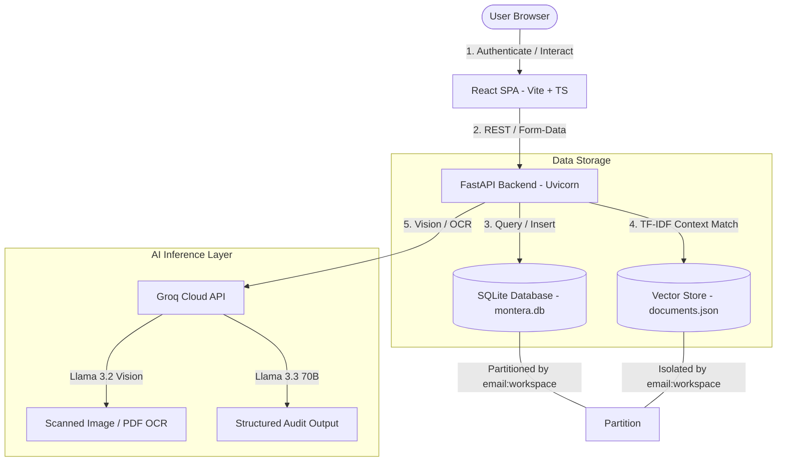

# 💼 Montera – AI Financial Auditor + Personal Tracker

Montera is a premium, full-stack financial platform designed to bridge unstructured scans, statements, and receipts into structured accounting ledgers. It features a dual-persona design: a **Business / AI Auditing Workspace** for freelancers and analysts, and a **Personal Tracker** for household bookkeeping.

<p align="center">
  
</p>

---

## 📽️ Video Demonstrations

*   👉 **[Insert Business AI Auditing Video Drive Link]**
*   👉 **[Insert Personal Tracker Video Drive Link]**

---

## 👥 Target Users & Value Propositions

*   **Freelancers:** Instantly map business expenses to IRS Schedule C tax classifications, separate personal transactions from business spending, and track net margin.
*   **Small Business Owners:** Monitor real-time cash flow, forecast quarterly financial trends, and visualize monthly runway burn rates.
*   **Bookkeepers & Financial Analysts:** Upload dense invoices, statements, or bank ledgers, run AI-assisted audits to isolate pricing discrepancies, and save verified fields directly to the company ledger.

---

## 🚀 Key Features

### 1. Business Workspace (AI Auditing & OCR)
*   **Intelligent Ingestion:** Normalizes upload extensions (PDF, PNG, JPG, WEBP). Digital PDFs are read natively using `pypdf`, while image scans route to **Llama 3.2 Vision** on the Groq API for visual OCR.
*   **RAG Anomaly Detection:** Compares parsed elements against contract policies (like Stripe or AWS billing terms) to automatically flag billing discrepancies and one-time fee anomalies.
*   **Schedule C Classifier:** Automatically pre-selects tax categories (e.g. *Office/Software* for cloud services, *Travel & Lodging* for rideshares) using extracted vendor names.
*   **2026 Cash-Flow Dashboard:** Translucent glassmorphic KPI cards displaying net revenue, outflow totals, monthly trend lines, and cash runway projections.
*   **Sandbox Demo Mode:** Toggle realistic mock consulting payouts, cloud hosting fees, and utilities to explore charts without uploading files.
*   **Quick-Add Entries:** Record manual transactions directly into the SQLite ledger in two clicks.

### 2. Personal Workspace (Finance Tracker)
*   **Category Budgets:** Create budget limits (e.g., Groceries, Internet) and visualize monthly allowance consumption.
*   **Savings Goals:** Track savings progress dynamically (e.g., buying a laptop) showing percentage markers and deadlines.
*   **Visual Reports:** Donut charts and trend lines mapping housing, utilities, and educational spending distributions.

---

## 🔒 Multi-Tenant Data Isolation (System Design)

Montera enforces strict account isolation at both storage levels (relational and vector database):



*   **The Composite Key:** Every request incorporates your login email and workspace: `user_id = "${email}:${workspace}"` (e.g. `maliha@montera.ai:local`).
*   **Segregated Storage:** Database rows and vector document chunks carry this composite tag. If a new user logs in, they will see a completely fresh, empty state (BDT 0.00 expenses, clean charts), preventing cross-user profile leaks.

---

## 🛠️ Technology Stack

*   **Frontend:** React 18, TypeScript, Vite, Recharts, Lucide Icons, and Vanilla CSS with custom glassmorphic variables.
*   **Backend:** FastAPI (Python 3.10+), Uvicorn, LangChain Expression Language (LCEL).
*   **Databases:** SQLite (`montera.db`) and a local TF-IDF vector database (`documents.json`).
*   **Orchestration:** Docker & Docker Compose.

---

## 📝 Case Study: AI Auditing Ingestion Test
*(Demonstrated in the Business Workspace)*

*   **The Document:** We uploaded a client invoice (`montera_client_invoice.pdf`) totaling **BDT 45,000.00** and asked the AI: *"Find unusual expenses"*.
*   **The AI Audit Output:**
    *   **Extracted Info:** Vendor (*Montera Corp*), Billing Date (*July 03, 2026*), Total (*BDT 45,000.00*).
    *   **Flagged Anomaly:** The auditor flagged the **BDT 38,000.00 "Dashboard Setup & Consulting Fee"** as a pricing anomaly, noting it was a high, one-time setup cost compared to the recurring monthly retainer of **BDT 7,000.00**, advising the bookkeeper to review it.
    *   **Relational Update:** Saving this invoice instantly drew a downward cash burn curve on the dashboard projection, indicating that BDT 45,000.00 was parsed as a monthly expense.

---

## 🚀 Getting Started

### Option A — Run via Docker (Recommended)
1.  **Configure API Key:** Create a `.env` file at the project root and add your Groq API key:
    ```env
    GROQ_API_KEY=gsk_your_actual_key_here
    ```
2.  **Start Services:** Run Docker Compose:
    ```bash
    docker compose up --build
    ```
3.  **Access App:** Navigate to `http://localhost:3000` inside your browser. The backend routes API requests to `http://localhost:8000`.

### Option B — Run Locally
1.  **Backend Startup:**
    ```bash
    cd backend
    pip install -r requirements.txt
    python -m uvicorn main:app --reload --host 0.0.0.0 --port 8000
    ```
2.  **Frontend Startup:**
    ```bash
    cd frontend
    npm install
    npm start
    ```

---

## 🎨 Local Branding Asset Setup

If you are pushing this code to a public GitHub repository and want the images to load relatively, copy the PNG assets from your local app cache into the workspace folder by executing this PowerShell command:

```powershell
Copy-Item "C:\Users\mdj52\.gemini\antigravity-ide\brain\55265836-c3eb-4a72-828e-e9736f12ecdb\montera_logo_1783077890484.png" "montera_logo.png"
Copy-Item "C:\Users\mdj52\.gemini\antigravity-ide\brain\55265836-c3eb-4a72-828e-e9736f12ecdb\montera_architecture_flow_1783080137368.png" "montera_architecture_flow.png"
```

Once copied, you can update the image paths in this README to `./montera_logo.png` and `./montera_architecture_flow.png` respectively.
